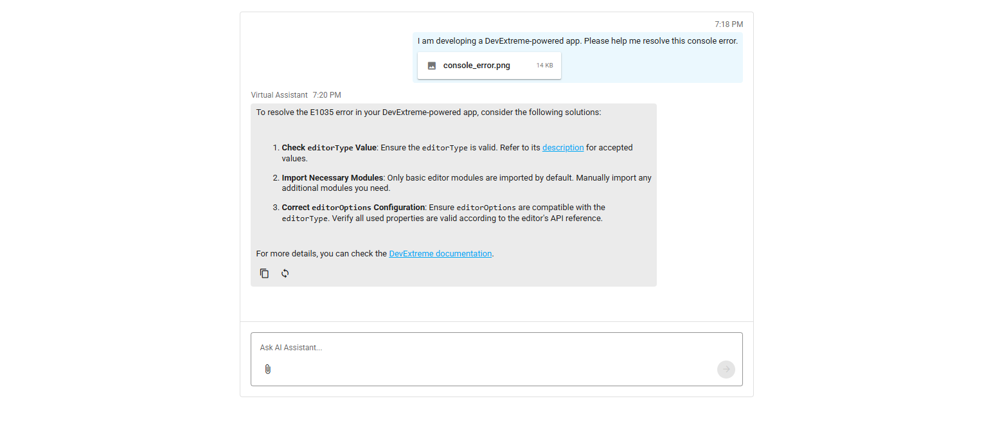

<!-- default badges list -->

<!-- default badges end -->
# DevExtreme Chat - AI Integration with Microsoft Agent Framework

This example integrates the [DevExtreme Chat](https://js.devexpress.com/Documentation/Guide/UI_Components/Chat/Overview/) UI component with an AI assistant (using agents built with the [Microsoft Agent Framework](https://learn.microsoft.com/en-us/agent-framework/overview/)).

The backend controller ([ChatController.cs](ChatServer/Controllers/ChatController.cs)) handles incoming chat messages, runs a multi-agent workflow (vision analysis, DevExpress documentation lookup using MCP tools, and response editing), and returns the assistant’s response. Client apps (Angular/React/Vue/jQuery/ASP.NET Core) send user messages to the backend and update the Chat UI with the assistant’s responses.

## Chat Server

This example includes a preconfigured ASP.NET Web API server (see [ChatServer](/ChatServer/)) that communicates with AI agents built with the [Microsoft Agent Framework](https://github.com/microsoft/agent-framework). The server runs at `http://localhost:5005` and exposes the following endpoints:
- `/api/Chat/GetAIResponse` (POST)
- `/api/Chat/GetUserMessages` (GET)

## Configure the Chat Component

All framework projects share the same implementation.

1. Communication with the server is handled in the [onMessageEntered](https://js.devexpress.com/Documentation/ApiReference/UI_Components/dxChat/Configuration/#onMessageEntered) function. [reloadOnChange](https://js.devexpress.com/Documentation/ApiReference/UI_Components/dxChat/Configuration/#reloadOnChange) is disabled, so the handler directly [pushes updates to the store](https://js.devexpress.com/Documentation/Guide/Data_Binding/Data_Layer/#Data_Modification/Integration_with_Push_Services).

2. The [fileUploaderOptions](https://js.devexpress.com/Documentation/ApiReference/UI_Components/dxChat/Configuration/#fileUploaderOptions) property configures file upload:
    - The [uploadFile](https://js.devexpress.com/Documentation/ApiReference/UI_Components/dxFileUploader/Configuration/#uploadFile) function enables file upload operations in the Chat UI. The [onValueChanged](https://js.devexpress.com/Documentation/ApiReference/UI_Components/dxFileUploader/Configuration/#onValueChanged) handler accesses the selected files and caches them manually.
    - [allowedFileExtensions](https://js.devexpress.com/Documentation/ApiReference/UI_Components/dxFileUploader/Configuration/#allowedFileExtensions) limits allowed file extensions.
    - [dropZone](https://js.devexpress.com/Documentation/ApiReference/UI_Components/dxFileUploader/Configuration/#dropZone), [onDropZoneEnter](https://js.devexpress.com/Documentation/ApiReference/UI_Components/dxFileUploader/Configuration/#onDropZoneEnter), and [onDropZoneLeave](https://js.devexpress.com/Documentation/ApiReference/UI_Components/dxFileUploader/Configuration/#onDropZoneLeave) enable drag & drop operations.

## Run the Example

1. Start the server:
    - Follow the instructions in [ChatServer README](ChatServer/README.md).

2. Start a client app:
    - For Angular/React/Vue/jQuery, go to the corresponding folder and run `npm install`, then run the project's start script (`npm start` or `npm run dev`).
    - For ASP.NET Core, go to the ASP.NET Core folder and run the project (`dotnet run` or from Visual Studio). The ASP.NET Core project hosts its own backend, so you do not need to run ChatServer separately.

## Files to Review

- **jQuery**
    - [index.js](jQuery/src/index.js)
- **Angular**
    - [app.component.html](Angular/src/app/app.component.html)
    - [app.component.ts](Angular/src/app/app.component.ts)
    - [app.service.ts](Angular/src/app/app.service.ts)
- **Vue**
    - [ChatInterface.vue](Vue/src/components/ChatInterface.vue)
    - [helpers.ts](Vue/src/helpers.ts)
- **React**
    - [ChatApp.tsx](React/src/components/ChatApp.tsx)
    - [MessageTemplate.tsx](React/src/components/MessageTemplate.tsx)
    - [ChatService.ts](React/src/ChatService.ts)
- **ASP.NET Core**
    - [Index.cshtml](ASP.NET%20Core/Views/Home/Index.cshtml)
    - [ChatController.cs](ASP.NET%20Core/Controllers/ChatController.cs)
    - [Program.cs](ASP.NET%20Core/Program.cs)
- **Chat Server**
    - [Program.cs](ChatServer/Program.cs) - AI agents and workflow configuration
    - [ChatController.cs](ChatServer/Controllers/ChatController.cs) - Chat API endpoints for the agent workflow
    - [DataService.cs](ChatServer/Services/DataService.cs) - Session-based message storage

## Documentation

- [DevExtreme Chat Overview](https://js.devexpress.com/Documentation/Guide/UI_Components/Chat/Overview/)
- [DevExtreme Chat API Reference](https://js.devexpress.com/Documentation/ApiReference/UI_Components/dxChat/)
- [Integrate DevExtreme Chat with AI Service](https://js.devexpress.com/Documentation/Guide/UI_Components/Chat/Integrate_with_AI_Service/)

## More Examples

- [Chat with OpenAI](https://github.com/DevExpress-Examples/devextreme-chat-openai-integration)
- [Chat with Google Dialogflow](https://github.com/DevExpress-Examples/devextreme-chat-google-dialogflow)
- [Chat with Azure OpenAI (.NET)](https://github.com/DevExpress-Examples/devextreme-chat-integration-azure-openai-dotnet)

## Does this example address your development requirements/objectives?

 

(you will be redirected to DevExpress.com to submit your response)
<!-- feedback end -->
<!-- feedback -->
## Does This Example Address Your Development Requirements/Objectives?

 

(you will be redirected to DevExpress.com to submit your response)
<!-- feedback end -->
